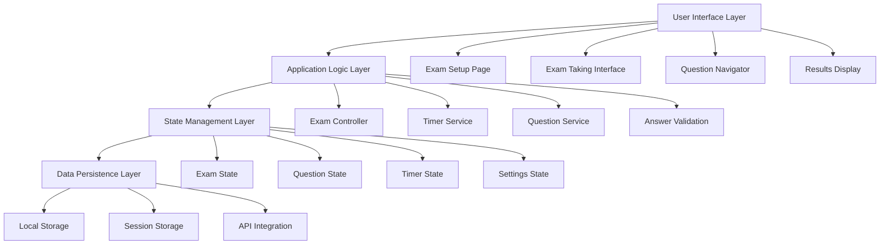
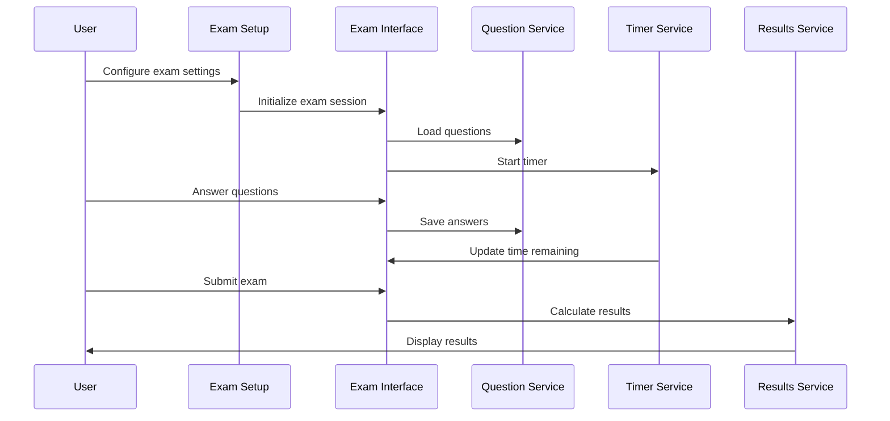

# Design Document

## Overview

The exam engine is a comprehensive React-based testing system built on Next.js 15 with TypeScript, utilizing Radix UI components and Tailwind CSS for styling. The system provides both practice and test modes for certification exams, with features including question navigation, progress tracking, time management, and detailed result analytics.

The design leverages the existing application architecture, which includes:
- Next.js App Router with TypeScript
- Radix UI component library for accessible UI components
- Tailwind CSS for styling with custom design system
- Client-side state management with React hooks
- Route-based navigation with dynamic segments

## Architecture

### High-Level Architecture



### Component Architecture

The exam engine follows a modular component architecture:

1. **Page Components**: Route-level components that orchestrate the exam experience
2. **Feature Components**: Reusable components for specific exam functionality
3. **UI Components**: Low-level UI components from the existing design system
4. **Hook Components**: Custom React hooks for state management and business logic

### Data Flow



## Components and Interfaces

### Core Components

#### 1. ExamSetup Component
- **Purpose**: Configure exam type, settings, and preferences
- **Location**: `/src/components/exam/exam-setup.tsx`
- **Props Interface**:
```typescript
interface ExamSetupProps {
  onExamStart: (config: ExamConfig) => void;
  availableExamTypes: ExamType[];
  defaultSettings: ExamSettings;
}
```

#### 2. ExamInterface Component
- **Purpose**: Main exam taking interface with question display and navigation
- **Location**: `/src/components/exam/exam-interface.tsx`
- **Props Interface**:
```typescript
interface ExamInterfaceProps {
  sessionId: string;
  examConfig: ExamConfig;
  questions: Question[];
  onExamComplete: (results: ExamResults) => void;
}
```

#### 3. QuestionNavigator Component
- **Purpose**: Visual navigation between questions with status indicators
- **Location**: `/src/components/exam/question-navigator.tsx`
- **Props Interface**:
```typescript
interface QuestionNavigatorProps {
  questions: Question[];
  currentQuestionIndex: number;
  answeredQuestions: Set<number>;
  bookmarkedQuestions: Set<number>;
  onQuestionSelect: (index: number) => void;
}
```

#### 4. TimerDisplay Component
- **Purpose**: Countdown timer with warnings and auto-submit
- **Location**: `/src/components/exam/timer-display.tsx`
- **Props Interface**:
```typescript
interface TimerDisplayProps {
  timeRemaining: number;
  isTestMode: boolean;
  onTimeExpired: () => void;
  showWarnings: boolean;
}
```

#### 5. QuestionDisplay Component
- **Purpose**: Render different question types with answer selection
- **Location**: `/src/components/exam/question-display.tsx`
- **Props Interface**:
```typescript
interface QuestionDisplayProps {
  question: Question;
  selectedAnswer: Answer | null;
  onAnswerSelect: (answer: Answer) => void;
  isBookmarked: boolean;
  onBookmarkToggle: () => void;
  showExplanation?: boolean;
}
```

#### 6. ExamReview Component
- **Purpose**: Summary view of all questions and answers before submission
- **Location**: `/src/components/exam/exam-review.tsx`
- **Props Interface**:
```typescript
interface ExamReviewProps {
  questions: Question[];
  answers: Map<number, Answer>;
  onQuestionSelect: (index: number) => void;
  onSubmit: () => void;
}
```

### Custom Hooks

#### 1. useExamState Hook
```typescript
interface ExamState {
  currentQuestionIndex: number;
  answers: Map<number, Answer>;
  bookmarkedQuestions: Set<number>;
  timeRemaining: number;
  examStatus: 'setup' | 'in-progress' | 'review' | 'completed';
}

const useExamState = (examConfig: ExamConfig) => {
  // State management logic
  return {
    state: ExamState,
    actions: {
      setCurrentQuestion: (index: number) => void,
      saveAnswer: (questionIndex: number, answer: Answer) => void,
      toggleBookmark: (questionIndex: number) => void,
      submitExam: () => void,
    }
  };
};
```

#### 2. useTimer Hook
```typescript
const useTimer = (initialTime: number, onExpired: () => void) => {
  return {
    timeRemaining: number,
    isRunning: boolean,
    start: () => void,
    pause: () => void,
    reset: () => void,
  };
};
```

#### 3. useExamPersistence Hook
```typescript
const useExamPersistence = (sessionId: string) => {
  return {
    saveProgress: (state: ExamState) => void,
    loadProgress: () => ExamState | null,
    clearProgress: () => void,
  };
};
```

## Data Models

### Core Data Types

```typescript
interface ExamConfig {
  id: string;
  type: 'practice' | 'test';
  examType: 'full-mock' | 'domain-quiz' | 'knowledge-area';
  timeLimit?: number; // in seconds
  settings: ExamSettings;
  domain?: string;
  knowledgeArea?: string;
}

interface ExamSettings {
  showTimer: boolean;
  showProgress: boolean;
  allowReview: boolean;
  showExplanations: boolean;
  allowBookmarks: boolean;
  shuffleQuestions: boolean;
  shuffleAnswers: boolean;
}

interface Question {
  id: string;
  text: string;
  type: 'multiple-choice' | 'multiple-select' | 'true-false';
  options: string[];
  correctAnswer: number | number[]; // single or multiple correct answers
  explanation: string;
  domain: string;
  knowledgeArea: string;
  difficulty: 'easy' | 'medium' | 'hard';
  imageUrl?: string;
}

interface Answer {
  questionId: string;
  selectedOptions: number[];
  timestamp: Date;
  timeSpent: number; // in seconds
}

interface ExamSession {
  id: string;
  userId: string;
  examConfig: ExamConfig;
  startTime: Date;
  endTime?: Date;
  currentQuestionIndex: number;
  answers: Map<number, Answer>;
  bookmarkedQuestions: Set<number>;
  status: 'in-progress' | 'completed' | 'abandoned';
}

interface ExamResults {
  sessionId: string;
  totalQuestions: number;
  answeredQuestions: number;
  correctAnswers: number;
  score: number; // percentage
  passed: boolean;
  timeSpent: number;
  domainScores: Map<string, DomainScore>;
  questionResults: QuestionResult[];
}

interface DomainScore {
  domain: string;
  totalQuestions: number;
  correctAnswers: number;
  score: number;
}

interface QuestionResult {
  questionId: string;
  correct: boolean;
  selectedAnswer: number[];
  correctAnswer: number[];
  timeSpent: number;
  domain: string;
}
```

## Error Handling

### Error Types and Handling Strategy

1. **Network Errors**: Graceful degradation with offline capability
2. **Timer Expiration**: Automatic submission with user notification
3. **Data Persistence Errors**: Fallback to session storage
4. **Invalid Question Data**: Skip invalid questions with logging
5. **Browser Compatibility**: Progressive enhancement approach

### Error Boundaries

```typescript
interface ExamErrorBoundaryState {
  hasError: boolean;
  error: Error | null;
  errorInfo: ErrorInfo | null;
}

class ExamErrorBoundary extends Component<PropsWithChildren, ExamErrorBoundaryState> {
  // Error boundary implementation for exam components
}
```

### Validation Rules

1. **Answer Validation**: Ensure answers match question type constraints
2. **Time Validation**: Prevent negative time values and handle edge cases
3. **Session Validation**: Verify session integrity and prevent tampering
4. **Configuration Validation**: Validate exam settings before starting

## Testing Strategy

### Unit Testing

1. **Component Testing**: Test individual components with React Testing Library
2. **Hook Testing**: Test custom hooks with @testing-library/react-hooks
3. **Utility Testing**: Test helper functions and validation logic
4. **State Management Testing**: Test state transitions and side effects

### Integration Testing

1. **Exam Flow Testing**: Test complete exam taking workflow
2. **Timer Integration**: Test timer functionality with exam state
3. **Persistence Testing**: Test data saving and loading
4. **Navigation Testing**: Test question navigation and state preservation

### End-to-End Testing

1. **Complete Exam Scenarios**: Test full exam taking experience
2. **Different Exam Types**: Test practice vs test mode differences
3. **Time Expiration Scenarios**: Test automatic submission
4. **Browser Compatibility**: Test across different browsers

### Performance Testing

1. **Large Question Sets**: Test performance with 180+ questions
2. **Memory Usage**: Monitor memory consumption during long exams
3. **Timer Accuracy**: Verify timer precision and reliability
4. **State Update Performance**: Test state update efficiency

### Accessibility Testing

1. **Keyboard Navigation**: Ensure full keyboard accessibility
2. **Screen Reader Support**: Test with screen readers
3. **Color Contrast**: Verify WCAG compliance
4. **Focus Management**: Test focus handling during navigation

## Security Considerations

### Client-Side Security

1. **Answer Obfuscation**: Prevent easy access to correct answers in client code
2. **Session Integrity**: Implement session validation and tampering detection
3. **Time Manipulation**: Prevent client-side timer manipulation
4. **Data Sanitization**: Sanitize all user inputs and question content

### Data Protection

1. **Local Storage Encryption**: Encrypt sensitive data in local storage
2. **Session Management**: Secure session handling and cleanup
3. **Answer Submission**: Secure transmission of exam results
4. **Privacy Compliance**: Ensure GDPR/CCPA compliance for user data

## Performance Optimization

### Rendering Optimization

1. **Component Memoization**: Use React.memo for expensive components
2. **Virtual Scrolling**: Implement for large question lists
3. **Lazy Loading**: Load questions on-demand for large exams
4. **State Optimization**: Minimize unnecessary re-renders

### Memory Management

1. **Question Cleanup**: Clean up unused question data
2. **Timer Cleanup**: Proper cleanup of timer intervals
3. **Event Listener Management**: Clean up event listeners
4. **State Persistence**: Efficient state serialization/deserialization

### Network Optimization

1. **Question Prefetching**: Preload next questions
2. **Answer Batching**: Batch answer submissions
3. **Offline Support**: Cache questions for offline use
4. **Progressive Loading**: Load exam content progressively

## Responsive Design

### Breakpoint Strategy

1. **Mobile First**: Design for mobile devices first
2. **Tablet Optimization**: Optimize for tablet interfaces
3. **Desktop Enhancement**: Enhanced features for desktop
4. **Touch Support**: Full touch interface support

### Layout Adaptations

1. **Question Display**: Responsive question layout
2. **Navigation**: Adaptive navigation patterns
3. **Timer Display**: Context-appropriate timer placement
4. **Review Interface**: Responsive review and summary views

## Integration Points

### Existing System Integration

1. **Authentication**: Integrate with existing AuthGuard system
2. **Routing**: Use Next.js App Router patterns
3. **UI Components**: Leverage existing Radix UI components
4. **Styling**: Follow existing Tailwind CSS patterns

### Future API Integration

1. **Question Management**: API endpoints for question CRUD
2. **Result Storage**: API for exam result persistence
3. **Analytics**: Integration with analytics systems
4. **User Progress**: API for progress tracking

### Third-Party Services

1. **Analytics**: Google Analytics or similar for usage tracking
2. **Error Monitoring**: Sentry or similar for error tracking
3. **Performance Monitoring**: Performance monitoring integration
4. **A/B Testing**: Framework for testing different exam experiences