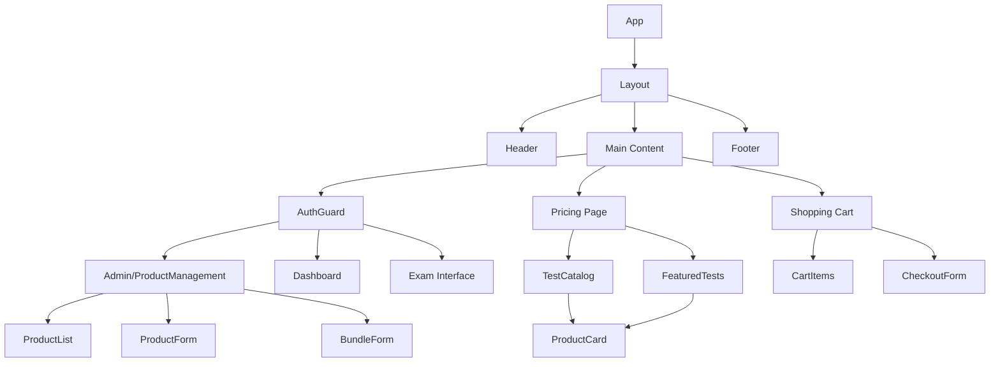

# Certify Application - Foundational Refactoring Design Document

## 1. Overview

This document outlines the foundational refactoring of the Certify application to pivot from a subscription-based model to a transactional e-commerce model. The refactoring involves transforming the data models, authorization logic, and admin panel to support selling individual practice tests and bundles as one-time purchases.

### Key Objectives
- Replace subscription "Plans" with product-centric models
- Implement ownership-based access control instead of role-based subscriptions
- Transform admin panel from plan management to product management
- Establish foundation for e-commerce flow (catalog → cart → checkout)
- Create mock API layer to decouple frontend from backend implementation
- Implement optimistic UI for enhanced user experience

## 2. Technology Stack & Dependencies

The application continues to use the existing technology stack with targeted additions:

- **Framework**: Next.js 15 with App Router
- **Language**: TypeScript 5.x
- **Styling**: Tailwind CSS 4.x
- **UI Components**: shadcn/ui (Radix UI primitives)
- **State Management**: React Context API
- **Form Handling**: React Hook Form
- **Validation**: Zod
- **Testing**: Jest, React Testing Library

### New Dependencies
- Shopping cart state management solution
- Additional UI components for e-commerce features

## 3. Component Architecture

### Component Hierarchy



### Core Component Definitions

#### Admin Panel Components
- **ProductManagement**: Main admin interface for product/bundle management
- **ProductList**: Grid display of all products and bundles
- **ProductForm**: Form for creating/editing individual products
- **BundleForm**: Form for creating/editing product bundles

#### User-Facing Components
- **FeaturedTests**: Homepage section showcasing key products
- **TestCatalog**: Catalog view of all available products/bundles
- **ProductCard**: Reusable card component for displaying products
- **ShoppingCart**: Slide-out cart panel for managing purchases
- **CheckoutForm**: Purchase confirmation and processing interface

#### Modified Existing Components
- **AuthGuard**: Updated to check ownership instead of subscription status
- **PlansManagement**: Refactored to ProductManagement

### Props/State Management

#### ProductManagement Component
```typescript
interface ProductManagementProps {
  userRole: 'admin' | 'super_admin';
}

interface ProductManagementState {
  products: Product[];
  bundles: Bundle[];
  selectedProduct: Product | null;
  isEditing: boolean;
  isLoading: boolean;
}
```

#### ProductCard Component
```typescript
interface ProductCardProps {
  product: Product | Bundle;
  onAddToCart: (product: Product | Bundle) => void;
  onViewDetails: (product: Product | Bundle) => void;
}
```

## 4. Routing & Navigation

### New Routes
- `/admin/products` - Admin product management dashboard
- `/tests` - Product catalog/test library
- `/tests/[slug]` - Individual product detail page
- `/bundles/[slug]` - Bundle detail page
- `/cart` - Shopping cart
- `/checkout` - Checkout process

### Modified Routes
- `/pricing` → `/tests` (replaced pricing page with test catalog)
- `/admin/plans` → `/admin/products` (refactored plan management)

### Route Protection
- Admin routes: Protected by role-based access (`admin`, `super_admin`)
- Product detail routes: Public access with ownership checks for content access
- Checkout route: Protected by authentication

## 5. Styling Strategy

### Design System Updates
- Maintain existing color palette with new e-commerce focused elements
- Add pricing-specific components (pricing cards, featured badges)
- Implement shopping cart UI patterns

### Component Styling
- Continue using Tailwind CSS utility classes
- Maintain shadcn/ui component styling consistency
- Add new variants for product/bundle display components

## 6. State Management

### Global State
- User authentication and profile data
- Shopping cart state
- Product catalog data

### Local State
- Form inputs for product management
- UI state for modals and drawers
- Filtering/sorting options in catalog

### Context Providers
```typescript
// Cart Context
interface CartContextType {
  items: CartItem[];
  addItem: (product: Product | Bundle) => void;
  removeItem: (productId: string) => void;
  updateQuantity: (productId: string, quantity: number) => void;
  clearCart: () => void;
  total: number;
}

// Product Context
interface ProductContextType {
  products: Product[];
  bundles: Bundle[];
  loading: boolean;
  fetchProducts: () => Promise<void>;
  fetchProductBySlug: (slug: string) => Promise<Product | null>;
}
```

### Optimistic UI Implementation

For the shopping cart functionality, we'll implement optimistic updates to provide a responsive user experience:

```typescript
// Optimistic cart update example
const optimisticAddToCart = async (product: Product | Bundle) => {
  // 1. Immediately update UI state
  dispatch({ type: 'ADD_ITEM', payload: product });
  
  // 2. Update local storage
  updateLocalStorageCart(state.items);
  
  // 3. Make API call in background
  try {
    await apiClient.purchases.addToCart(product.id);
    // Success - no further action needed
  } catch (error) {
    // Rollback UI if API call fails
    dispatch({ type: 'REMOVE_ITEM', payload: product.id });
    updateLocalStorageCart(state.items);
    showErrorNotification('Failed to add item to cart');
  }
};
```

## 7. API Integration Layer

### Mock API Layer Structure

To decouple the frontend from backend implementation, we will create a dedicated mock API layer that simulates all required backend functionality.

**Directory Structure:**
```
src/lib/mock-api/
├── index.ts
├── products.ts
├── bundles.ts
├── purchases.ts
└── data/
    ├── products.json
    ├── bundles.json
    └── purchases.json
```

### Mock API Implementation

The mock API will provide functions that simulate HTTP requests and manage data in-memory or through JSON files.

```typescript
// src/lib/mock-api/products.ts

// Fetch all published products
export const fetchAllProducts = async (): Promise<Product[]> => {
  // Simulate API delay
  await new Promise(resolve => setTimeout(resolve, 300));
  
  // Return only published products (where publishedAt is not null)
  return mockProducts.filter(product => product.publishedAt !== null);
};

// Find product by slug
export const findProductBySlug = async (slug: string): Promise<Product | undefined> => {
  await new Promise(resolve => setTimeout(resolve, 300));
  return mockProducts.find(product => product.slug === slug && product.publishedAt !== null);
};

// Admin functions
export const fetchAllProductsAdmin = async (): Promise<Product[]> => {
  await new Promise(resolve => setTimeout(resolve, 300));
  return mockProducts; // Return all products including drafts
};

export const createProduct = async (productData: Omit<Product, 'id' | 'createdAt' | 'updatedAt'>): Promise<Product> => {
  await new Promise(resolve => setTimeout(resolve, 300));
  
  const newProduct: Product = {
    id: generateId(),
    ...productData,
    createdAt: new Date(),
    updatedAt: new Date()
  };
  
  mockProducts.push(newProduct);
  return newProduct;
};

export const updateProduct = async (id: string, updates: Partial<Product>): Promise<Product> => {
  await new Promise(resolve => setTimeout(resolve, 300));
  
  const index = mockProducts.findIndex(p => p.id === id);
  if (index === -1) throw new Error('Product not found');
  
  mockProducts[index] = {
    ...mockProducts[index],
    ...updates,
    updatedAt: new Date()
  };
  
  return mockProducts[index];
};
```

### API Client Abstraction

To ensure seamless transition to a real backend later, we'll create an abstraction layer:

```typescript
// src/lib/api-client.ts

export interface ApiClient {
  products: {
    getAll: () => Promise<Product[]>;
    getBySlug: (slug: string) => Promise<Product | undefined>;
    // Admin methods
    getAllAdmin: () => Promise<Product[]>;
    create: (product: Omit<Product, 'id'>) => Promise<Product>;
    update: (id: string, updates: Partial<Product>) => Promise<Product>;
  };
  
  bundles: {
    getAll: () => Promise<Bundle[]>;
    getBySlug: (slug: string) => Promise<Bundle | undefined>;
    // Admin methods
    getAllAdmin: () => Promise<Bundle[]>;
    create: (bundle: Omit<Bundle, 'id'>) => Promise<Bundle>;
    update: (id: string, updates: Partial<Bundle>) => Promise<Bundle>;
  };
  
  purchases: {
    getByUserId: (userId: string) => Promise<Purchase[]>;
    create: (purchase: Omit<Purchase, 'id' | 'purchaseDate'>) => Promise<Purchase>;
  };
}

// Current implementation uses mock API
export const apiClient: ApiClient = {
  products: {
    getAll: mockApi.products.fetchAllProducts,
    getBySlug: mockApi.products.findProductBySlug,
    getAllAdmin: mockApi.products.fetchAllProductsAdmin,
    create: mockApi.products.createProduct,
    update: mockApi.products.updateProduct
  },
  // ... other services
};
```

## 8. Data Models

### New Data Models

#### Product
```typescript
interface Product {
  id: string;
  name: string;
  slug: string;
  price: { amount: number; currency: 'USD' };
  description: string;
  type: 'Exam' | 'Quiz' | 'DomainQuiz';
  questionIds: string[];
  status: 'Active' | 'Draft' | 'Archived';
  isFeatured?: boolean;
  publishedAt: Date | null;
  createdAt: Date;
  updatedAt: Date;
}
```

#### Bundle
```typescript
interface Bundle {
  id: string;
  name: string;
  slug: string;
  price: { amount: number; currency: 'USD' };
  description: string;
  productIds: string[];
  status: 'Active' | 'Draft' | 'Archived';
  discountPercentage?: number;
  isFeatured?: boolean;
  publishedAt: Date | null;
  createdAt: Date;
  updatedAt: Date;
}
```

#### Purchase
```typescript
interface Purchase {
  id: string;
  userId: string;
  productId?: string;
  bundleId?: string;
  purchaseDate: Date;
  amount: { amount: number; currency: 'USD' };
  status: 'Completed' | 'Pending' | 'Failed';
}
```

### Migration from Subscription Model

The existing `Plan` model will be deprecated and replaced:

| Old Model (Plan) | New Model | Migration Strategy |
|------------------|-----------|-------------------|
| `id` | `id` | Direct mapping |
| `name` | `name` | Direct mapping |
| `price` | `price` | Direct mapping |
| `billingPeriod` | *(removed)* | One-time purchases |
| `features` | *(removed)* | Direct product access |
| `status` | `status` | Direct mapping |
| `isPopular` | `isFeatured` | Renamed field |

## 9. Business Logic Layer

### Authorization Logic Transformation

#### Before (Subscription-based)
```typescript
// Auth service checking subscription
const hasAccessToFeature = (user: User, feature: string): boolean => {
  if (!user.subscription || !user.subscription.isActive) return false;
  return user.subscription.plan.features.includes(feature);
};

// Component using subscription check
const ExamComponent = () => {
  const { user } = useAuth();
  
  if (!hasAccessToFeature(user, 'full_exam_access')) {
    return <UpgradePrompt />;
  }
  
  return <ExamInterface />;
};
```

#### After (Ownership-based)
```typescript
// Auth service checking ownership using mock API
const hasPurchasedProduct = async (userId: string, productId: string): Promise<boolean> => {
  const purchases = await mockApi.purchases.getByUserId(userId);
  return purchases.some(p => 
    p.productId === productId || 
    (p.bundleId && isProductInBundle(p.bundleId, productId))
  );
};

// Component using ownership check
const ExamComponent = ({ productId }) => {
  const { user } = useAuth();
  
  useEffect(() => {
    const checkAccess = async () => {
      const hasAccess = await hasPurchasedProduct(user.id, productId);
      if (!hasAccess) {
        router.push(`/tests/${productId}`);
      }
    };
    
    checkAccess();
  }, [user, productId]);
  
  return <ExamInterface />;
};
```

### Product Management Logic

#### CRUD Operations
```typescript
// Product service using mock API
const productService = {
  create: async (productData: Omit<Product, 'id' | 'createdAt' | 'updatedAt'>): Promise<Product> => {
    // Validate slug uniqueness
    // Generate ID
    // Set timestamps
    return await mockApi.products.createProduct(productData);
  },
  
  update: async (id: string, updates: Partial<Product>): Promise<Product> => {
    // Validate updates
    // Update timestamp
    return await mockApi.products.updateProduct(id, updates);
  },
  
  delete: async (id: string): Promise<void> => {
    // Check for dependencies
    // Mark as archived instead of hard delete
    return await mockApi.products.updateProduct(id, { status: 'Archived' });
  }
};
```

#### Bundle Pricing Logic
```typescript
const calculateBundlePrice = (bundle: Bundle, products: Product[]): { amount: number; currency: 'USD' } => {
  const individualPrices = bundle.productIds
    .map(id => {
      const product = products.find(p => p.id === id);
      return product ? product.price.amount : 0;
    })
    .reduce((sum, price) => sum + price, 0);
    
  if (bundle.discountPercentage) {
    return { amount: individualPrices * (1 - bundle.discountPercentage / 100), currency: 'USD' };
  }
  
  return { amount: individualPrices, currency: 'USD' };
};
```

### Purchase Processing Logic

#### Cart Management
```typescript
interface CartItem {
  product: Product | Bundle;
  quantity: number;
}

const cartService = {
  addItem: (cart: CartItem[], product: Product | Bundle): CartItem[] => {
    // Check if item already in cart
    // Add new item or update quantity
    // Return updated cart
    const existingItem = cart.find(item => item.product.id === product.id);
    if (existingItem) {
      return cart.map(item => 
        item.product.id === product.id 
          ? { ...item, quantity: item.quantity + 1 } 
          : item
      );
    } else {
      return [...cart, { product, quantity: 1 }];
    }
  },
  
  removeItem: (cart: CartItem[], productId: string): CartItem[] => {
    // Remove item from cart
    // Return updated cart
    return cart.filter(item => item.product.id !== productId);
  },
  
  updateQuantity: (cart: CartItem[], productId: string, quantity: number): CartItem[] => {
    if (quantity <= 0) return cartService.removeItem(cart, productId);
    
    return cart.map(item => 
      item.product.id === productId 
        ? { ...item, quantity } 
        : item
    );
  },
  
  calculateTotal: (cart: CartItem[]): { amount: number; currency: 'USD' } => {
    const total = cart.reduce((sum, item) => {
      return sum + (item.product.price.amount * item.quantity);
    }, 0);
    return { amount: total, currency: 'USD' };
  }
};
```

#### Purchase Processing
```typescript
const purchaseService = {
  processPurchase: async (userId: string, cart: CartItem[]): Promise<Purchase[]> => {
    // Validate cart items
    // Calculate total
    const totalAmount = cartService.calculateTotal(cart);
    
    // Create purchase records for each item
    const purchases: Purchase[] = [];
    
    for (const item of cart) {
      const purchase: Omit<Purchase, 'id' | 'purchaseDate'> = {
        userId,
        productId: 'productId' in item.product ? item.product.id : undefined,
        bundleId: 'productIds' in item.product ? item.product.id : undefined,
        amount: { amount: item.product.price.amount * item.quantity, currency: 'USD' },
        status: 'Completed'
      };
      
      const newPurchase = await mockApi.purchases.create(purchase);
      purchases.push(newPurchase);
    }
    
    // Clear cart
    // Return purchase confirmations
    return purchases;
  }
};
```

## 10. Testing Strategy

### Component Testing

#### ProductManagement Component
- Test product listing display
- Test form validation and submission
- Test edit/delete functionality
- Test loading and error states
- Test draft/published state management

#### ProductCard Component
- Test rendering with different product types
- Test add to cart functionality
- Test view details navigation
- Test price display with currency

#### ShoppingCart Component
- Test item addition/removal
- Test quantity updates
- Test total calculation
- Test checkout navigation
- Test optimistic UI updates

### Business Logic Testing

#### Authorization Service
- Test ownership verification logic
- Test bundle content access
- Test edge cases (no purchases, invalid IDs)
- Test draft product access restrictions

#### Product Service
- Test CRUD operations
- Test validation rules
- Test error handling
- Test slug uniqueness validation

#### Purchase Service
- Test cart operations
- Test purchase processing
- Test transaction integrity
- Test bundle purchase fulfillment

### Mock API Testing

#### Data Persistence
- Test mock data persistence between sessions
- Test concurrent access handling
- Test error simulation

#### API Contract
- Verify all required endpoints are implemented
- Test data validation in mock API
- Test response time simulation

### Integration Testing

#### End-to-End Flows
1. Admin creates product → User browses catalog → User purchases product → User accesses content
2. Admin creates bundle → User adds to cart → User completes checkout → User accesses all bundled products

#### Data Consistency
- Verify product/bundle relationships
- Verify purchase records accuracy
- Verify access control enforcement

### Migration Testing
- Test data transformation scripts
- Verify backward compatibility
- Test performance impact of new models

## 11. Phased Execution Plan

Based on the CTO's directives, the implementation will follow this prioritized approach:

### Phase 1: The Foundation (Highest Priority)
*Goal: Build the bedrock of the new system.*

1.  **Implement Data Models:** Define the TypeScript interfaces for `Product`, `Bundle`, and `Purchase` in a shared types directory (e.g., `src/types/ecommerce.ts`), incorporating the CTO's refinements.
2.  **Create Mock API Layer:** Build out the `src/lib/mock-api/` with mock data and functions for fetching and managing products/bundles.
3.  **Refactor Admin Panel:** Execute the full refactoring of `/admin/plans` into `/admin/products`. This new page should consume data *only* from your new mock API layer. This will be the primary tool for us to manage test data during development.

### Phase 2: The Storefront
*Goal: Create the new user-facing catalog and product discovery experience.*

1.  **Implement Homepage `FeaturedTests` Component:** Build the new homepage section precisely as specified in the target UI example. It should fetch its data from the mock API.
2.  **Refactor `/pricing` to `/tests`:** Create the new "Test Library" page at `/tests`. This page will display all products and bundles fetched from the mock API, using the `ProductCard` component you've designed.
3.  **Implement Product/Bundle Detail Pages:** Build out the dynamic routes at `/tests/[slug]` and `/bundles/[slug]`.

### Phase 3: The Transactional Flow
*Goal: Enable the core e-commerce functionality.*

1.  **Implement Shopping Cart:** Create the `CartContext` and the slide-out `ShoppingCart` component. Ensure products can be added, removed, and quantities updated with optimistic UI updates.
2.  **Build Checkout Page & Logic:** Create the `/checkout` page. Implement the `purchaseService` logic to simulate a successful transaction, which should result in creating a mock `Purchase` record for the logged-in user.
3.  **Overhaul Authorization Logic:** Refactor the `AuthGuard` to use an ownership check (e.g., `hasPurchasedProduct(userId, productId)`). This check should query your mock `Purchase` data.