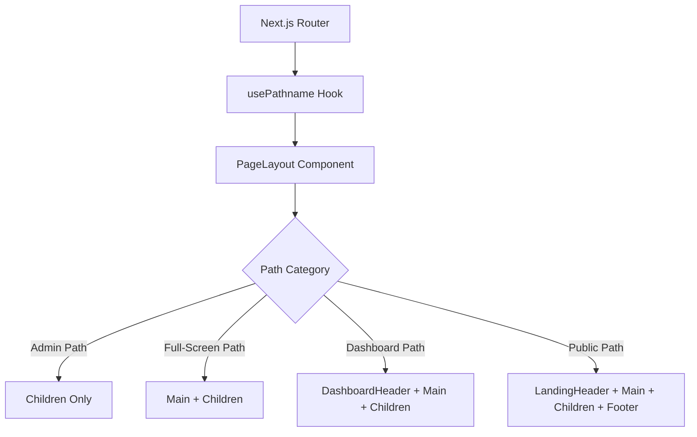

# PageLayout Component Design Document

## Overview

This document outlines the design and implementation of a centralized `PageLayout` component that will eliminate redundant header components across various pages in the Certify application. The component will intelligently render the appropriate header and footer based on the current route, improving maintainability and ensuring UI consistency.

## Architecture

### Component Structure

The `PageLayout` component will be a client component that wraps all pages in the application and conditionally renders headers and footers based on the current route path. The component will be located at `src/components/layout/page-layout.tsx`.

### Path-Based Rendering Logic

The component will categorize routes into the following groups:

1. **Public Paths**: `/`, `/tests`, `/bundles/*`, `/cart`, `/checkout` - Render `LandingHeader` and main site `Footer`
2. **Dashboard Paths**: `/dashboard`, `/profile` - Render `DashboardHeader` and no footer
3. **Full-Screen Paths**: `/login`, `/signup`, `/forgot-password`, `/reset-password`, `/exam/*`, `/practice/*` - Render no header and no footer
4. **Admin Paths**: `/admin/*` - Render no header and no footer (AdminLayout provides its own UI shell)

### Component Dependencies

The component will depend on the following existing components:
- `LandingHeader` from `@/components/landing/header`
- `DashboardHeader` from `@/components/dashboard/header`
- `Footer` component (to be created at `@/components/layout/footer.tsx`)

## Component Architecture

### PageLayout Component Definition

```tsx
'use client';

import { usePathname } from 'next/navigation';
import { LandingHeader } from '@/components/landing/header';
import { DashboardHeader } from '@/components/dashboard/header';
import { Footer } from '@/components/layout/footer'; // To be created

export interface PageLayoutProps {
  children: React.ReactNode;
}

export function PageLayout({ children }: PageLayoutProps) {
  const pathname = usePathname();

  // Determine which layout to use
  const isAdminPath = pathname.startsWith('/admin');
  const isDashboardPath = pathname.startsWith('/dashboard') || pathname.startsWith('/profile');
  const isAuthPath = ['/login', '/signup', '/forgot-password', '/reset-password'].includes(pathname);
  const isExamPath = pathname.startsWith('/exam') || pathname.startsWith('/practice');
  
  const isFullScreen = isAuthPath || isExamPath;
  const isPublicPath = !isAdminPath && !isDashboardPath && !isFullScreen;

  // The Admin section handles its own layout entirely
  if (isAdminPath) {
    return <>{children}</>;
  }

  // Full-screen layouts have no shell
  if (isFullScreen) {
    return <main>{children}</main>;
  }

  return (
    <div className="flex flex-col min-h-screen">
      {isPublicPath && <LandingHeader />}
      {isDashboardPath && <DashboardHeader />}
      <main className="flex-grow">
        {children}
      </main>
      {isPublicPath && <Footer />}
    </div>
  );
}
```

### Integration with Root Layout

The `PageLayout` component will be integrated into the root layout at `src/app/layout.tsx`:

```tsx
import type { Metadata } from "next";
import { Inter } from "next/font/google";
import "./globals.css";
import { cn } from "@/lib/utils";
import { CartProvider } from "@/context/cart-context";
import { PageLayout } from "@/components/layout/page-layout";
// Development components (commented out for production)
import { DevAuthPanel } from "@/components/dev/dev-auth-panel";
import { DevStatusBar } from "@/components/dev/dev-status-bar";

const inter = Inter({
  subsets: ["latin"],
  variable: "--font-sans",
});

export const metadata: Metadata = {
  title: "Certify | PMP Exam Prep",
  description: "The smartest way to prepare for and pass your PMP exam with confidence.",
};

export default function RootLayout({
  children,
}: Readonly<{
  children: React.ReactNode;
}>) {
  return (
    <html lang="en" className="scroll-smooth">
      <body className={cn("min-h-screen bg-white font-sans text-foreground antialiased", inter.variable)}>
        <CartProvider>
          <DevStatusBar />
          <PageLayout>
            {children}
          </PageLayout>
          <DevAuthPanel />
        </CartProvider>
      </body>
    </html>
  );
}
```

## Cleanup Process

### Files Requiring Header/Footer Removal

The following files will have their hardcoded header and footer components removed:

1. `src/app/page.tsx` - Remove `<Header />` and `<footer>`
2. `src/app/tests/page.tsx` - Remove `<header>` and `<footer>`
3. `src/app/bundles/[slug]/page.tsx` - Remove `<header>` and `<footer>`
4. `src/app/cart/page.tsx` - Remove `<header>` and `<footer>`
5. `src/app/checkout/page.tsx` - Remove `<header>` and `<footer>`
6. `src/app/dashboard/page.tsx` - Remove `<DashboardHeader />`
7. `src/app/pricing/page.tsx` - Remove `<header>` and `<footer>`

### Footer Component Creation

A shared `Footer` component will be created at `src/components/layout/footer.tsx` to consolidate the repeated footer code found across multiple pages. The component will contain:

```tsx
export function Footer() {
  return (
    <footer className="bg-background border-t">
      <div className="container mx-auto px-6 py-8">
        <div className="flex flex-col md:flex-row justify-between items-center space-y-4 md:space-y-0">
          <div className="text-sm text-muted-foreground">
            &copy; 2025 Certify. All Rights Reserved.
          </div>
          <div className="flex space-x-6 text-sm font-medium">
            <a href="#" className="text-muted-foreground hover:text-primary transition-colors">Privacy</a>
            <a href="#" className="text-muted-foreground hover:text-primary transition-colors">Terms</a>
            <a href="#" className="text-muted-foreground hover:text-primary transition-colors">Contact</a>
          </div>
        </div>
      </div>
    </footer>
  );
}
```

## Data Flow Architecture



## Implementation Steps

### Phase 1: Component Development

1. Create `src/components/layout/page-layout.tsx` with the routing logic
2. Create `src/components/layout/footer.tsx` by extracting common footer code
3. Test component in isolation with different path scenarios

### Phase 2: Integration

1. Modify `src/app/layout.tsx` to wrap children with `PageLayout`
2. Verify that the component works correctly with all route categories

### Phase 3: Code Cleanup

1. Remove hardcoded headers and footers from the specified page files:
   - `src/app/page.tsx`
   - `src/app/tests/page.tsx`
   - `src/app/bundles/[slug]/page.tsx`
   - `src/app/cart/page.tsx`
   - `src/app/checkout/page.tsx`
   - `src/app/dashboard/page.tsx`
   - `src/app/pricing/page.tsx`
2. Test each page to ensure proper rendering
3. Verify that admin section still functions correctly with its own layout

## Testing Strategy

### Unit Testing

1. Test path categorization logic with various route inputs
2. Verify correct component rendering for each path category
3. Test edge cases like nested routes and dynamic routes

### Integration Testing

1. Verify that all public pages render with LandingHeader and Footer
2. Confirm dashboard pages render with DashboardHeader and no footer
3. Ensure authentication and exam pages render without headers or footers
4. Validate that admin section continues to use its own layout

### Validation Checklist

- [ ] Public pages (/, /tests, /bundles/*, /cart, /checkout) display LandingHeader and Footer
- [ ] Dashboard pages (/dashboard, /profile) display DashboardHeader without Footer
- [ ] Authentication pages (/login, /signup, /forgot-password, /reset-password) display neither header nor footer
- [ ] Exam pages (/exam/*, /practice/*) display neither header nor footer
- [ ] Admin section (/admin/*) continues to function with its own layout
- [ ] All pages maintain proper spacing and styling after header/footer changes
- [ ] Responsive design works correctly on all page types

## Error Handling and Edge Cases

1. The component gracefully handles unknown paths by defaulting to the public layout (LandingHeader + Footer)
2. Dynamic routes (e.g., `/bundles/[slug]`, `/tests/[slug]`) are properly categorized through `startsWith` checks
3. The component handles edge cases where pathnames might be undefined or malformed

## Performance Considerations

1. The component uses lightweight conditional rendering based on string operations
2. Client-side only hooks (`usePathname`) are used efficiently
3. Component tree remains shallow with minimal re-renders
4. No additional data fetching is required for layout decisions

## Security Considerations

1. No sensitive data is handled in the layout component
2. Path-based logic uses standard Next.js routing mechanisms
3. Component does not introduce new attack vectors

## Backward Compatibility

The implementation maintains full backward compatibility as it centralizes existing functionality without changing the visual appearance or behavior of any pages.

## Maintainability and Future Enhancements

1. Adding new route categories only requires updating the path categorization logic
2. Modifying header or footer components can be done independently
3. The component structure allows for easy addition of new layout types
4. Centralized layout logic makes it easier to implement features like:
   - Global banners or notifications
   - A/B testing for different layouts
   - User preference-based layouts
   - Seasonal or promotional headers